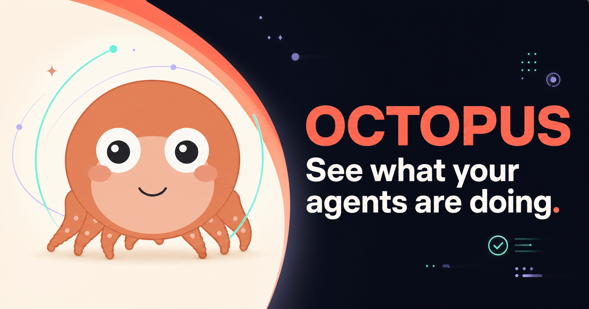

# 🐙 八宝 Octobao

  
<strong>简体中文</strong> · <a href="./README_EN.md">English</a>

  

  
<strong>你的 AI 在忙什么，八宝替你看着。</strong>

  
把 AI 编程 Agent 的工作状态，变成一只常驻桌面的透明小章鱼。

  

    <a href="https://octopus-agent-companion.jiajiayaoabc.chatgpt.site/"><strong>官方网站</strong></a>
    ·
    <a href="https://github.com/jiajiayao/Octobao/releases/tag/v0.1.0-early-preview.1"><strong>下载 Windows / macOS 预览版</strong></a>
    ·
    <a href="https://github.com/jiajiayao/Octobao/releases">全部版本</a>
    ·
    <a href="https://github.com/jiajiayao/Octobao/issues">反馈问题</a>
  

> [!IMPORTANT]
> **Early Preview · Windows x64 + macOS Apple Silicon · Closed Source** 
> Windows 当前未签名，macOS 使用 ad-hoc 临时签名且尚未经过 Apple 公证。请只从本仓库的 Releases 下载，并在安装前阅读版本说明。

当前公开版本是 [`v0.1.0-early-preview.1`](https://github.com/jiajiayao/Octobao/releases/tag/v0.1.0-early-preview.1)（2026-07-14）。它是预览版，不代表代码签名、公证、干净机和完整双平台验收已经完成。

## 八宝是做什么的？

八宝不是聊天窗口，也不会代替你操作 Agent。它负责把后台工作变成一眼能懂的桌面状态：

- **它还在工作吗？** 睡着表示当前没有任务；醒着表示 Agent 正在处理事情。
- **它正在做什么？** 思考、搜索、阅读、编辑、运行命令、浏览网页等动作都有不同表情和动画。
- **它是不是在等我？** `your turn` 会提醒你输入、选择或批准；`review` 表示回复已经准备好。
- **是不是有多个任务？** 多个 Agent 或会话会显示成独立任务徽章，不用逐个切换窗口查看。

打开你平时使用的 Agent 开始工作，八宝就会自动醒来。它不会占用一个新的聊天窗口，也不需要水冷屏或其他硬件。

## 状态图鉴

八宝底部的状态文字、表情和右上角图形会一起变化：

| 状态文字 | 你会看到什么 | 代表什么 |
|---|---|---|
| `idle` | 闭眼休息，睡眠气泡缓慢飘动 | Agent 在线，但当前没有任务 |
| `offline` | 灰色的休息状态 | 暂时没有收到可用的 Agent 状态 |
| `thinking` / `reasoning` | 思考气泡中的圆点依次亮起 | 正在规划、推理或理解上下文 |
| `processing` | 多个圆点向中心汇聚 | 正在整理工具结果，准备下一步 |
| `searching` | 放大镜来回扫描 | 正在搜索代码、文件或本地资源 |
| `reading` | 打开的书页轻轻翻动 | 正在读取文件或资料 |
| `editing` | 铅笔书写并配合键盘动作 | 正在修改代码、文档或其他文件 |
| `running` | 小终端和旋转进度弧 | 正在执行命令、测试、构建或工具 |
| `browsing` | 地球与环绕光点 | 正在使用网页、浏览器或电脑操作工具 |
| `delegating` | 多个任务节点围绕中心协作 | 正在派发子任务或协调多个 Agent |
| `responding` | 两层光环持续流动 | 正在生成并输出回复 |
| `compacting` | 两侧圆弧向内收拢 | 正在整理较长的上下文 |
| `your turn` | 问号和醒目的等待表情 | 需要你输入、选择、确认或批准 |
| `review` | 笑脸和对勾 | Agent 已经回复，等你查看结果 |
| `error` | 警告标志和错误表情 | 当前工具、请求或任务执行失败 |

工作期间，底部还可能显示：

- `TOK`：当前任务的 token 数量；带 `~` 时表示估算值。
- `RUN`：当前任务已经运行的时间。

不同 Agent 能提供的信息不同，因此某些数字可能不会出现；这不影响状态动画。

## 多任务时会发生什么？

当多个 Agent、会话或子任务同时工作时，八宝会进入多任务指挥模式：

- 主章鱼保持稳定，不会因为每个小任务切换动作而反复变脸。
- 顶部每个徽章代表一个任务，并分别显示思考、阅读、编辑、运行或等待等状态。
- 任务太多放不下时，会用 `+N` 显示其余任务数量。
- 默认达到 4 个忙碌任务时会戴上墨镜；达到 8 个时会进入火眼状态。

> `Boost` 只是对并行任务数量的趣味视觉表达，不会让模型或 Agent 自动加速。

  

## 日常使用

- **移动：** 按住八宝拖到桌面的任意位置。
- **缩放：** 鼠标移到八宝上后，拖动右上角出现的缩放区域。
- **自动记忆：** 位置和大小会在下次启动时恢复。
- **右键菜单：** 可以恢复默认大小/位置、打开日志目录或退出桌宠。
- **开机启动：** 使用安装包装好后，八宝会随当前 Windows 用户登录启动。
- **透明置顶：** 八宝浮在其他窗口上方，不会显示独立控制台或设置窗口。

## 支持的 Agent

| Agent | 当前预览版状态 |
|---|---|
| Claude Code | 已支持 |
| Codex | 已支持 |
| Qoder Quest | 早期支持，接入体验仍在完善 |
| WorkBuddy | 早期支持，首次接入可能需要确认 Hook |

不需要安装全部 Agent。八宝只显示这台电脑上实际存在的 Agent 和会话，未安装的 Agent 不会生成虚假任务。

## 平台与下载

| 平台 | 当前状态 |
|---|---|
| Windows x64 | Early Preview 已提供下载 |
| macOS Apple Silicon | Early Preview 已提供下载；需要 macOS 13+ |
| macOS Intel / Universal | 暂无发布计划 |

请只从 [GitHub Releases](https://github.com/jiajiayao/Octobao/releases) 下载：

1. Windows 用户推荐下载 `Octobao-Windows-x64-Setup-unsigned.exe`。
2. Windows 便携 ZIP 适合手动测试，不提供安装、登录启动和开始菜单入口。
3. Apple Silicon Mac 用户下载 `Octobao-macOS-arm64-adhoc.dmg`。
4. Windows 可能显示“未知发布者”；macOS 首次打开可能需要在 Finder 中按住 Control 点击八宝并选择“打开”。
5. 校验文件分别为 `SHA256SUMS-unsigned.txt` 和 `SHA256SUMS-macOS-arm64-adhoc.txt`。

> [!WARNING]
> GitHub 自动生成的 `Source code (zip)` 和 `Source code (tar.gz)` 不是八宝安装包。请勿从第三方网盘、转载页面或不明镜像下载。

## 隐私与本地处理

八宝采用 **Local-first** 设计：状态在你的电脑上读取、判断和显示。

- 不自动上传 prompt、回复、会话正文、工具参数或工具结果。
- 不自动上传凭据、截图、日志或诊断文件。
- 不替你批准权限、回答问题或向 Agent 发送命令。
- 本地诊断日志只用于排查问题；提交 Issue 时请只附必要且已脱敏的片段。

## 常见问题

### 八宝需要水冷屏或其他硬件吗？

不需要。Windows 与 macOS 版本都是独立桌面宠物，不包含 LCD、USB、RGB、传感器或硬件监控功能。

### 必须同时安装四个 Agent 吗？

不需要。你可以只使用其中一个；没有安装的 Agent 会保持休眠。

### 八宝会控制我的 Agent 吗？

不会。八宝目前只观察和展示状态，所有输入、权限和决定仍由你完成。

### 八宝开源吗？

暂不开源。本仓库用于产品介绍、官方二进制分发和问题反馈，不包含产品源代码。

## 反馈问题

欢迎通过 [GitHub Issues](https://github.com/jiajiayao/Octobao/issues) 提交 Bug 或建议。请尽量附上八宝版本、Windows 版本、使用的 Agent、复现步骤，以及不包含私人内容的截图或已脱敏日志片段。

请勿公开上传完整会话、原始日志目录、凭据或包含真实项目路径的截图。

## 版权说明

八宝 Octobao 目前不是开源软件。未经书面授权，请勿重新打包、镜像分发、冒充官方版本，或复制产品程序、角色形象、动画、图形和品牌素材用于其他商业产品。发布包中的第三方组件仍分别适用其原始许可证。

Claude Code、Codex、Qoder Quest 和 WorkBuddy 是其各自权利人的产品或商标。八宝是独立项目，不代表与上述产品存在官方隶属、合作或背书关系。

---

  Made with 🐙 for people working with too many Agents.

