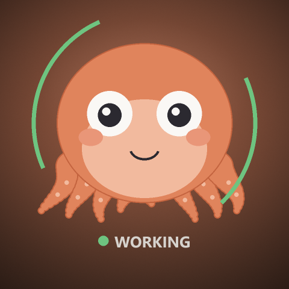

# 🐙 八宝 Octobao

  
<strong>简体中文</strong> · <a href="./README_EN.md">English</a>

  

  
<strong>你的 AI 在忙什么，八宝替你看着。</strong>

  
面向 AI 编程 Agent 的本地桌面小章鱼。

  

    <a href="./releases/latest"><strong>下载最新版本</strong></a>
    ·
    <a href="./releases">查看全部版本</a>
    ·
    <a href="./issues">反馈问题</a>
  

> [!IMPORTANT]
> **当前状态：Early Preview · Closed Source**  
> 本仓库只用于产品介绍、官方二进制版本分发和问题反馈，暂不公开源代码。可下载平台和已实现功能以每个 Release 的说明为准；如果 Releases 中尚无安装包，说明当前仅开放介绍页。

## 八宝是什么？

八宝不是又一个聊天窗口，也不会取代你正在使用的 Agent。

它是一层常驻在桌面上的“AI 工作状态”：当 Agent 正在思考、读文件、改代码、执行命令、浏览网页或等待你确认时，八宝会用表情、动作和任务徽章告诉你。

你不用反复切换窗口，看一眼八宝，就知道 AI 现在是在干活，还是在等你。

## 看一眼就懂

| 你看到的八宝 | 代表的 Agent 状态 |
|---|---|
| 思考、推理 | 正在规划或处理上下文 |
| 搜索、阅读、浏览 | 正在查找或获取信息 |
| 编辑、执行 | 正在修改文件或运行工具 |
| 派发任务 | 正在调度子 Agent 或工作流 |
| `your turn` | 需要你输入、选择或批准 |
| `review` | Agent 已经回复，等你查看 |
| 任务徽章 | 多个 Agent 或会话正在并行工作 |

## 单任务与多任务

- **单任务**：八宝用一张大表情直接表达当前动作。
- **多任务**：八宝进入“指挥模式”，每个会话保留自己的状态徽章。
- **忙碌升级**：并行任务增多时，八宝会戴上墨镜，再进入火眼状态。
- **重要提示**：等待你、已回复和出错会使用更明确的视觉信号。

> `Boost` 只是多任务负载的视觉表达，不会改变模型速度或 Agent 性能。

  

## Agent 适配范围

| Agent | 当前进度 | 本地状态来源 |
|---|---|---|
| Claude Code | Adapter 已接入 | CLI Hooks；本地 transcript 可作为补充来源 |
| Codex | Adapter 已接入 | 本地 session / rollout 与 Hook 事件 |
| Qoder Quest | Adapter 已接入，安装集成完善中 | 本地 Quest 日志 |
| WorkBuddy | Hook ingress 已接入，安装集成完善中 | WorkBuddy Hooks；可能需要一次用户审核 |

不需要同时安装所有 Agent。八宝只使用本机已经存在且在对应版本中明确披露的状态来源；未安装的 Agent 应保持休眠，不创建虚假任务。

## 平台与发布状态

| 平台 | 架构 | 状态 |
|---|---|---|
| Windows | x64 | 透明桌宠原型已实现；公开预览包以 Releases 为准 |
| macOS | Apple Silicon arm64 | 计划中，尚无公开下载版本 |
| macOS | Intel / Universal | 暂无发布计划 |

Windows 原型当前已具备透明置顶、拖动、悬浮后连续缩放，以及保存位置和大小的基础能力。独立纯桌宠打包、干净机验证、统一日志边界与 macOS 实现仍在完善中。

## 下载

请只从本仓库的 [GitHub Releases](./releases) 下载八宝。

1. 打开 Releases，选择标明你的操作系统和架构的版本。
2. 仔细阅读该版本的功能、已知问题和数据访问说明。
3. 下载 Release Assets 中的官方安装包，并核对页面提供的 SHA-256。

> [!WARNING]
> GitHub 自动生成的 `Source code (zip)` 和 `Source code (tar.gz)` 不是八宝安装包。如果 Release 中没有其他可执行附件，说明该版本尚未提供二进制下载。

请勿从第三方网盘、转载页面或不明镜像下载，也不要使用未在 Releases 中明确标识的旧工程构建。

## 隐私与本地处理

八宝采用 **Local-first** 的产品设计。状态会在本机从对应 Agent 的 Hook、transcript / rollout 或日志中提取，然后在本地聚合并渲染。

公开分发版遵守以下边界：

- 不自动上传 prompt、response 或 transcript 正文；
- 不在八宝的状态库或诊断日志中保存 prompt、response 或工具正文；
- 不自动上传工具参数、工具结果、凭据、截图或诊断文件；
- 每个 Release 应明确列出会使用的本地数据来源与已知限制。

早期预览版的统一日志脱敏、容量轮转和诊断导出仍在完善。请不要把整个日志目录或原始会话数据上传到公开 Issue；提交前请人工检查，只附上必要且已脱敏的片段。

## 产品边界

桌宠版八宝专注于观察和展示 Agent 状态：

- 不代替你批准权限、回答问题或向 Agent 发送命令；
- 不将 LCD、USB、机箱屏、RGB 或硬件传感器功能打入桌宠公开包；
- 不把 CPU、RAM、温度、功耗、GPU 或风扇遥测作为桌宠功能；
- 不把未安装的 Agent 冒充成活跃会话。

## 常见问题

### 八宝开源吗？

暂不开源。本仓库不包含产品源代码，只用于产品介绍、官方二进制分发和问题反馈。

### 必须安装四个 Agent 吗？

不需要。每个 Agent 可以独立接入；对应数据来源不存在时，应保持休眠。

### 八宝会控制我的 Agent 吗？

不会。桌宠当前只观察和展示状态，不代替用户进行操作。

### 八宝会上传我的对话吗？

不会自动上传。为了判断状态，部分 Adapter 会在本机解析对应 Agent 产生的 Hook、transcript / rollout 或日志，但 prompt、response 和工具正文不应写入八宝状态库或诊断日志。

### 八宝需要水冷屏或其他硬件吗？

不需要。只有完成纯桌宠依赖剔除并通过发布验证的构建，才会作为官方桌宠包分发。

### 为什么 Releases 里没有我的系统？

说明该平台尚未通过公开分发验证。请不要从其他来源下载占位包或未验证构建。

## 反馈问题

欢迎通过 [GitHub Issues](./issues) 提交 Bug 或功能建议。为了帮助定位，请尽量提供：

- 八宝版本；
- 操作系统与架构；
- 使用的 Agent；
- 可重复的操作步骤；
- 不包含私人内容的截图或已脱敏日志片段。

请勿公开上传完整 transcript、会话数据库、原始日志目录、凭据，或含有真实项目路径的截图。

## 闭源与版权说明

八宝 Octobao 目前不是开源软件。

本仓库未附开源许可证，不代表产品程序、角色形象、动画、图形、品牌名称或官方素材可被自由复制、修改或再分发。欢迎分享本仓库的官方链接；未经书面授权，请勿重新打包、镜像分发、冒充官方版本或将官方素材用于其他商业产品。

如某个发布包附带单独许可条款，则以该版本的条款为准。发布包中的第三方组件仍分别适用其原始许可证。

Claude Code、Codex、Qoder Quest 和 WorkBuddy 是其各自权利人的产品或商标。八宝是独立项目，不代表与上述产品存在官方隶属、合作或背书关系。

---

  Made with 🐙 for people working with too many Agents.

